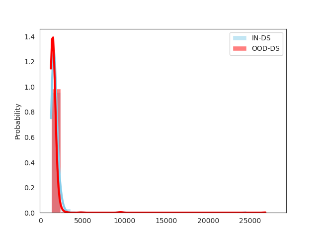
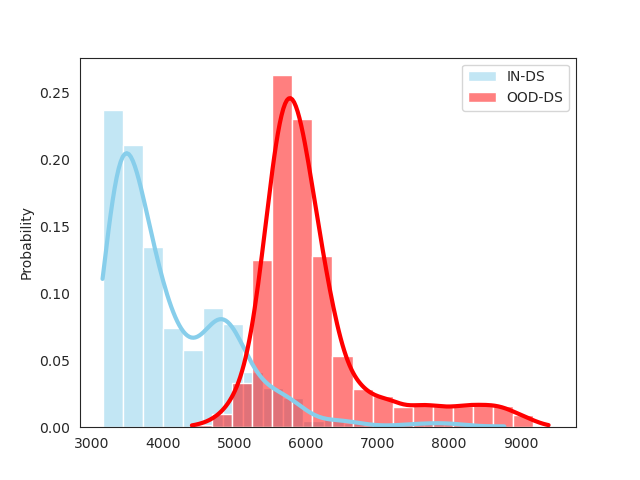

# Leveraging latent representations for efficient textual OOD detection


Source code of the paper [Leveraging latent representations for efficient textual OOD detection](https://www.overleaf.com/read/tzmhvvjdqbqr)


Abstract :

>*With the democratization of Large-Language-
Models through the release of products such as
ChatGPT, the public is being more and more
sensitive to flaws known for a long time in
the community. An example of that is the
overconfidence in the responses to Out-Of-
Distribution (OOD) queries. Those are likely
to be non-relevant and be detrimental to the
public sentiment. However, this could be
prevented by OOD detectors which are able
to determine whether the model will be able
to produce a satisfactory answer. We focus
our work on out-of-the-bag detectors that are
model-independent and do not leverage the
model structure, but only an input’s latent representations. We first reproduce the results
of Colombo et al. and Guerreiro et al. on
a restricted benchmark, then we argue that a
better leverage of latent representations can
lead to improved performances. To this extent, we introduce an exponential-based and an
euclidean-distance (LiLO) based methods to make our
point.*

___

## Onboarding  ⚡️

### Prerequisites
Install the required packages using the following command :
Make sure pip is up-to-date
```
pip install -r requirements.txt
```
### Walkthrough

The directory `ot_hallucination` contains the scripts and notebooks used to reproduce the results from [1]. Please run the downloading scripts first. Beware that the downloading links might need to be updated (see comments in script)
The notebook descibes the process to generate the plot in our paper

The directory `beyond_maha` contains the scripts and notebooks to reproduce the results from [2], but also to reproduce our results with exponential latent representation aggregation and Linear-$\ell_2$-opt (LiLO)

The embeddings can be generated by following the notebook `bert_generate_embd.ipynb` or downloaded using the first cells of `bert_benchmark.ipynb`. The authentification codes are likely to be outdated as they are daily-updated by our AWS S3 instance. The daily ids will be given upon request to the authors. 

`bert_benchmark.ipynb` uses objects defined in the `src` directory and principaly the class `
OODDetector`. This object is based on scikit-learn estimator for consistency and adaptability purposes. 

It can produce all methods presented in our paper. However, you should be careful to provide the right objects with each similarity measure.

In a nutshell :
| Object         	| Shape                       	| Similarity                      	|
|----------------	|-----------------------------	|---------------------------------	|
| Embeddings     	| ($n_{sample}$, 768, 12)     	| mahalanobis, IRW, LiLO          	|
| Logits         	| ($n_{sample}$, 2) 	        | MSP, E                          	|
| Attention maps 	| ($n_{sample}$, 768)         	| Wass2Unif, Wass2Data, WassCombo 	|

Moreover, several methods requires some additionnal kwargs to be specified. If unrequired arguments are specified, it will not cause an exception but they will not be used. 
|         	| Mahalanobis 	| IRW 	|   LiLO   	| Wass2Unif 	| Wass2Data 	| WassCombo 	| Energy 	| MSP 	|
|:-----------------------------:	|:-----------:	|:---:	|:--------:	|:---------:	|:---------:	|:---------:	|:------:	|:---:	|
|        Temperature (T)        	|             	|     	|          	|           	|           	|           	|    x   	|     	|
|       base_distribution       	|      x      	|  x  	|     x    	|           	|     x     	|     x     	|        	|     	|
|     base_ood_distribution     	|             	|     	|     x    	|           	|           	|           	|        	|     	|
| smallest # of distances to keep (k) 	|             	|     	|          	|           	|     x     	|     x     	|        	|     	|
|         sampling_ratio        	|             	|     	| optional 	|           	|  optional 	|  optional 	|        	|     	|

### Use-case example :

```python

from src import OODDetector #check that beyond_maha is in your sys.path

clf = OODDetector(similarity='LiLO', base_distribution=embd_imdb_train, 
base_ood_distribution=embd_sst2)

clf.fit() #mandatory

clf.predict(test_set)
```
A discussion is made about the design choice of the .fit method in the code of `_ood_classifier.py`.

A cautious reader might have spotted that the distribution plot are Z-normalized in order to be able to compare the distribution conditionnal on the predicted target.

The Integrated Rank Weighted Depth is computed using the code from [Guillaume Staerman](https://github.com/GuillaumeStaermanML/AIIRW).

---

## LiLO (Linear-$\ell_2$-opt)

LiLO is new method we introduced in our paper to leverage a better aggregation function when using the Euclidean norm as scoring method. We showed that given a relevant aggregation strategy, simpler norms can lead to competitive results compared to mean-aggregation and more evolved scoring methods. 

For example, here is the scores distribution using either mean-aggregation or LiLO for the euclidean norm. The train IN-DS dataset is IMBD, train OOD-DS SST2 and test OOD-DS WMT16.

|Mean |LiLO |
|:------:|:-------:|
|||
|The class are not easily separable $\rightarrow$ Low AUROC|Classes are easily separable $\rightarrow$ high AUROC|

We also introduced another method using exponential aggregation.


---

## References
[1] Nuno M. Guerreiro, Pierre Colombo, Pablo Piantanida,
and André F. T. Martins. 2022. [Optimal Transport
for Unsupervised Hallucination Detection in Neural
Machine Translation](https://arxiv.org/abs/2212.09631). ArXiv:2212.09631 [cs].

[2] Pierre Colombo, Eduardo D. C. Gomes, Guillaume
Staerman, Nathan Noiry, and Pablo Piantanida.
2022. [Beyond Mahalanobis-Based Scores for Tex-
tual OOD Detection.](https://arxiv.org/abs/2211.13527) ArXiv:2211.13527 [cs].